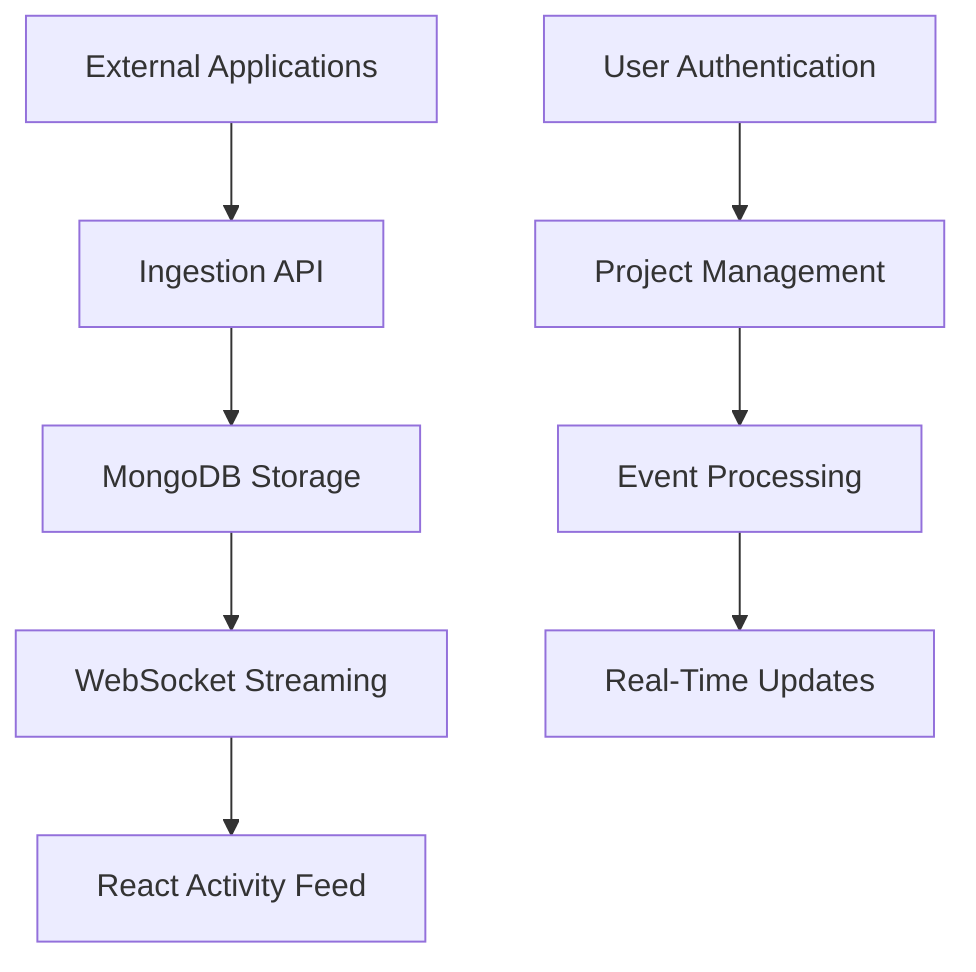

# OpsPulse 🚀

**Real-Time Monitoring Platform | MERN Stack**

A production-grade, multi-tenant monitoring platform that ingests structured events and renders them efficiently through a performance-optimized React interface.

[](https://nodejs.org/)
[](https://reactjs.org/)
[](https://mongodb.com/)
[](https://developer.mozilla.org/en-US/docs/Web/API/WebSockets_API)

---

## 📋 Table of Contents

- [Overview](#overview)
- [Problem Statement](#problem-statement)
- [Architecture](#architecture)
- [Features](#features)
- [Tech Stack](#tech-stack)
- [Project Structure](#project-structure)
- [Installation](#installation)
- [API Documentation](#api-documentation)
- [Security](#security)
- [Performance](#performance)
- [Development Phases](#development-phases)
- [Contributing](#contributing)
- [License](#license)

---

## 🎯 Overview

OpsPulse is a **project-based, real-time monitoring platform** designed to handle massive volumes of system events with enterprise-grade performance and security. It’s inspired by the way SaaS platforms like DataDog, New Relic, or Splunk operate at scale.

### Key Capabilities
- 🏗️ **Project-Based Architecture**: Organize monitoring around logical boundaries
- 📊 **Real-Time Event Streaming**: WebSocket-based live updates
- 🔒 **Multi-Tenant Security**: Strict data isolation between users
- ⚡ **High-Performance UI**: Virtualized rendering for 100k+ events
- 🎯 **Structured Event Ingestion**: RESTful APIs for seamless integration

---

## 🚨 Problem Statement

Modern engineering teams face critical challenges with observability:

| Challenge                       | Impact                        | OpsPulse Solution                 |
|----------------------------------|-------------------------------|-----------------------------------|
| **Massive Log Volumes**          | UI freezes, poor UX           | Virtualized rendering + pagination|
| **Continuous Event Streams**     | Real-time = hard on UI        | Optimized WebSocket streaming     |
| **Data Isolation**               | Security vulnerabilities      | Project-scoped multi-tenancy      |
| **Slow Dashboards**              | Poor developer experience     | Performance-engineered React      |

---

## 🏗️ Architecture

### System Overview

Event Sources → Ingestion API → Database → Streaming Layer → React UI

### Data Hierarchy

User (Authentication)  
└── Projects (Logical Boundaries)  
&emsp;&emsp;└── Events (Monitoring Data)

### Component Architecture

---

## ✨ Features

- **Identity & Security**
  - JWT-based stateless authentication
  - Bcrypt password hashing
  - Protected route middleware
  - Cross-user data isolation

- **Project Management**
  - Create monitoring projects
  - Project-scoped data boundaries
  - Ownership enforcement
  - Resource isolation

- **Event Ingestion**
  - RESTful event ingestion endpoints
  - Structured JSON validation
  - Automatic project association
  - Metadata support

- **Real-Time Streaming** (Planned)
  - WebSocket-based live updates
  - Project-scoped subscriptions
  - Efficient event broadcasting
  - Connection management

- **High-Performance UI** (Planned)
  - Virtualized event rendering
  - Live event insertion
  - Pause/resume functionality
  - Advanced filtering
  - Detail inspection panels

---

## 🛠️ Tech Stack

**Frontend:**
- React 18+
- Context API
- React Router
- Axios
- Tailwind CSS

**Backend:**
- Node.js
- Express.js
- JWT (Authentication tokens)
- Bcrypt (Password hashing)
- Mongoose

**Database:**
- MongoDB (Indexed collections, aggregation pipeline)

**Real-Time:**
- WebSocket (Socket.io planned)

---

## 📂 Project Structure

```
opspulse/
├── client/                 # React frontend
│   ├── src/
│   │   ├── components/
│   │   ├── context/
│   │   ├── pages/
│   │   ├── api/
│   │   └── utils/
│   └── public/
├── server/                 # Node.js backend
│   ├── controllers/
│   ├── middleware/
│   ├── models/
│   ├── routes/
│   └── utils/
├── docs/
└── README.md
```

---

## 🚀 Installation

**Prerequisites**
- Node.js 18+
- MongoDB 6+
- npm or yarn

**Quick Start**
```bash
# Clone the repository
git clone https://github.com/yourusername/opspulse.git
cd opspulse

# Install backend dependencies
cd server
npm install

# Install frontend dependencies
cd ../client
npm install

# Backend environment setup
cd ../server
cp .env.example .env
# Edit .env and set MongoDB URI and JWT secret

# Start the application
# Terminal 1 - backend
cd server
npm run dev

# Terminal 2 - frontend
cd ../client
npm start
```
Frontend: http://localhost:3000  
Backend API: http://localhost:5000

---

## 📚 API Documentation

**Authentication Endpoints**

- **Register User**
  - `POST /api/auth/register`
  - Content-Type: application/json
  - Body:
    ```json
    {
      "username": "john_doe",
      "email": "john@example.com",
      "password": "securePassword123"
    }
    ```

- **Login User**
  - `POST /api/auth/login`
  - Content-Type: application/json
  - Body:
    ```json
    {
      "email": "john@example.com",
      "password": "securePassword123"
    }
    ```

**Project Endpoints**

- **Create Project**
  - `POST /api/projects`
  - Authorization: Bearer <jwt_token>
  - Content-Type: application/json
  - Body:
    ```json
    {
      "name": "Production API",
      "description": "Main application monitoring"
    }
    ```
- **List Projects**
  - `GET /api/projects`
  - Authorization: Bearer <jwt_token>

---

# PHASE 3 — Event Ingestion Layer

## 🎯 Objective

Enable external applications to send structured events to OpsPulse through a secure, project-scoped ingestion API.

This phase introduces the platform’s core data entry mechanism.

---

## What Was Implemented

### 1️⃣ Project-Scoped Ingestion Endpoint

A dedicated ingestion route was created:

```
POST /ingest/:projectId
```

Each event is explicitly associated with a specific project.

This ensures:
- Clear monitoring boundaries
- Strict data ownership
- Elimination of cross-project contamination

---

### 2️⃣ Event Validation

Incoming events are validated before processing.

Each event must include structured fields such as:
- `message`
- `severity`
- `timestamp`
- (optional) `metadata`

Invalid events are rejected with clear error responses.  
This prevents malformed or inconsistent data from entering the system.

---

### 3️⃣ Project Verification

Before accepting an event:
- The backend verifies that the project exists
- The project ID in the route is validated
- Only valid projects can receive events

This guarantees all events belong to a legitimate monitoring target.

---

### 4️⃣ Event Persistence

Validated events are stored in the database with:
- projectId
- event details
- creation timestamp

This allows for:
- Historical inspection
- Future filtering and pagination

---

### 5️⃣ Separation of Responsibilities

The ingestion layer strictly:
- Receives events
- Validates input
- Persists data

It does **not**:
- Render UI
- Apply filtering logic
- Handle streaming logic

This separation keeps the system modular and scalable.

---

## Data Flow Introduced in Phase 3

```
External App
   ↓
POST /ingest/:projectId
   ↓
Validation
   ↓
Project Verification
   ↓
Event stored in database
```

This establishes OpsPulse as an event-driven system.

---

## Why Phase 3 Matters

Phase 3 transforms OpsPulse from a user-management system into a genuine monitoring platform.

It introduces:
- Structured event ingestion
- Project-level data boundaries
- Persistent system activity records

Without this phase, the monitoring system would have no authentic data source.

---

## Stop Condition (Phase Complete When)

- External systems can send events
- Events are correctly linked to projects
- Invalid data is rejected
- Events persist in the database

---

## Architectural Outcome

After Phase 3:
- Projects represent monitoring targets
- Events capture system activity
- Data boundaries are enforced at the project level
- The system is ready for real-time streaming (Phase 4)

---

## 🔒 Security

**Authentication Strategy**
- Stateless JWT tokens for scalability
- Bcrypt hashing with salt rounds for password security
- Middleware-based protection for all sensitive routes

**Data Isolation**
- Project-scoped queries prevent cross-user data access
- Backend-controlled ownership
- User context validated on every protected request

**Security Headers**
- CORS configuration
- Rate limiting (Planned)
- Input validation (Enforced)
- NoSQL/SQL injection prevention

---

## ⚡ Performance

**Frontend Optimizations (Planned)**
- Virtual scrolling for large datasets
- Memoized components
- Debounced filtering
- Lazy loading

**Backend Optimizations**
- Database indexing
- Connection pooling
- Async/await patterns

**Real-Time Performance (Planned)**
- WebSocket management
- Event batching and efficient updates

---

## 🚧 Development Phases
- ✅ Phase 1: Identity & Ownership (Completed)
- ✅ Phase 2: Project Boundaries (Completed)
- ✅ Phase 3: Event Ingestion (Completed)
- 📋 Phase 4: Real-Time Streaming (Planned)
- 📋 Phase 5: High-Performance UI (Planned)

---

## 🤝 Contributing

We welcome contributions! See our Contributing Guidelines for details.

**Development Workflow**
- Fork the repository
- Create a feature branch (`git checkout -b feature/amazing-feature`)
- Commit your changes (`git commit -m 'Add amazing feature'`)
- Push to the branch (`git push origin feature/amazing-feature`)
- Open a Pull Request

---

## 📄 License
This project is licensed under the MIT License – see the `LICENSE` file for details.

---

## 🎯 Why OpsPulse?

Unlike simple CRUD apps, OpsPulse demonstrates:
- Event-driven architecture for real-world scalability
- Multi-tenant security patterns as used in SaaS
- Real-time system design with WebSocket streaming
- Frontend performance engineering for large datasets
- Production-focused authentication and authorization patterns

Perfect for showcasing full-stack engineering skills in interviews and technical portfolios.

---

## 📞 Contact

**Project Maintainer:** [Your Name]  
GitHub: @yourusername  
LinkedIn: Your LinkedIn  
Email: your.email@example.com